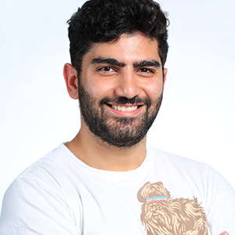
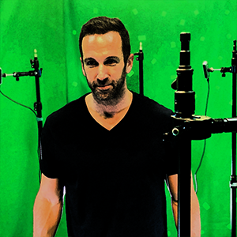
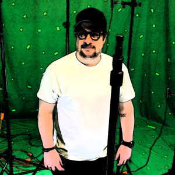
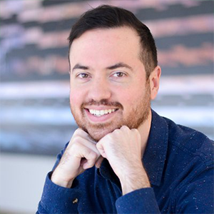

# Photogrammetry and Capture Technology
#### 7/18/2018  
### Co-Hosted/Co-Sponsored by [Vimeo](http://www.vimeo.com/), [Scatter](http://www.scatter.nyc/), and [Manhattan Edit Workshop](https://www.mewshop.com/)  
### Hosted at [Vimeo](https://www.vimeo.com/) Brooklyn  
### [Facebook Page](https://www.facebook.com/events/214434416060970/)
### [Archived Livestream Link](https://www.facebook.com/VolumetricFilmmakersNYC/videos/)

---

## PRESENTATIONS:  
### Happening Now — Kyle Kukshtel  
Kyle presented a brief summary of what has happened in the field of volumetric filmmaking and immersive media creation since the last event. He also did some group housekeeping, mainly mentioning the move from Meetup to Facebook.  
[View the Slides Here](assets/july2018/VFNYC_news_july2018.pdf)  

### **Creating The Aeronaut VR** — Rob Ruffler  

Hot off winning a Grand Prix at Cannes Lions, **ROB RUFFLER**, former VP of Viacom Next, will present his experience creating and co-directing (with David Liu) the volumetric film The Aeronaut VR, featuring Billy Corgan of The Smashing Pumpkins.

[Rob Ruffler](https://www.linkedin.com/in/robruffler/) is an award-winning Digital Media Executive who is passionate about the future of spatial entertainment. Formerly he was Vice President of Viacom NEXT, where he led strategy, content and product development on emerging platforms. Rob is a Cannes Lions Grand Prix award-winning director for his work on Aeronaut and an Emmy award-winner for the Nick app. He gets excited by projects that evoke strong emotions and maintains a natural curiosity about why people do the things they do.

### **Photogrammetry Deep Dive** — Az Balabanian  

**AZ BALABANIAN**, cinematographer, photogrammetry artist and founder of azadux, a creative productions agency, will talk about the challenges of some key projects in the photogrammetry space and how he is tackling this artform for VR & AR applications.

[Az Balabanian](https://twitter.com/azadux) is a Cinematographer, Virtual Reality Documentarian, and the founder of azadux, a Creative Productions agency. His work is largely based around a cutting-edge 3D mapping technique called Photogrammetry, which produces eerily familiar reprojections of places from this world. His love for Aerial Cinematography has taken him from Iceland to Armenia, documenting grand landscapes and a vast amount of history.

### **Creative Potential of 3D Scanning** — Rosalie Yu  

Creative technologist and artistic fellow at Columbia **ROSALIE YU** will talk about pushing 3D scanning and photogrammetry outside of its roots as a preservationists tool by showing what it looks like to approach the medium creatively.

[Rosalie Yu](https://www.instagram.com/rosalieyu/) uses alternative capturing techniques and immersive media to reflect upon photography, archives, and personal experience. Her work has been exhibited at the Tribeca film festival and ​Sotheby's, and featured in Creative Applications and The Verge. She is a creative technologist and artistic fellow at Columbia University’s Brown Institute for Media Innovation, and was formerly a tech resident at Pioneer Works and a research fellow at NYU’s Interactive Telecommunications Program.

### **Volumetric for Everyone** — Evercoast  

Direct from their public debut at the Cannes Lions, **BEN NUNEZ** (CEO) and **SEBASTIAN MARINO** (CTO) of the new Volumetric Capture platform [Evercoast](https://twitter.com/evercoast) will live demo & present their solutions for scalable, portable, affordable volumetric capture, for everyone.

[Ben Nunez](https://twitter.com/bininunez) is the CEO of Evercoast, a computer vision and 3D sensing company providing a software platform for the creation and distribution of volumetric video and holographic content. Prior to Evercoast, Ben was the CEO of Littlstar, the first 360/VR video content network. Ben has spent his career building product and launching campaigns for the world’s largest broadcasters, publishers and brands, including National Geographic Channel, Disney, Discovery, Hearst, and FOX. He has cofounded six companies with two successful exits under his belt.

[Sebastian Marino](https://twitter.com/waiting4yuki) is a 15 year veteran of the film industry, having worked on some of the largest franchises in history from Star Wars to Avatar. During that time he received an Academy Award for technical achievement, recognizing his artistic and research contributions to the industry. Recently Sebastian has become an entrepreneur and pioneer in the new media of volumetric filmmaking, having co-founded 8i. Now, as a co-founder of Evercoast, Sebastian looks to democratize 'volcap' by dramatically reducing the cost and complexity of content production so that advertisers, independent game & filmmakers, students, and everyone, can create and experiment with this fascinating new technology without million dollar budgets.

### **Accessible Volumetric Distribution** — Casey Pugh  

**CASEY PUGH**, Head of Creator Labs at Vimeo, will talk about the company's efforts, exploration and creator tools for Volumetric Filmmaking.

Casey Pugh is an Emmy-winning developer and designer immersed in the online video industry for the past 11 years. As Head of Creator Labs at Vimeo, Casey leads the vision, strategy and execution for pushing the video platform beyond its existing storytelling boundaries. In 2009, he created Star Wars Uncut, a crowd-sourced remake of classic Star Wars movies that won a 2010 Primetime Emmy. Casey was an early employee of Vimeo and co-founder of VHX, a technology solution for creators building and distributing premium over-the-top (OTT) video channels, which was acquired by Vimeo in May 2016.

# Items Discussed in Meetup
[Scatter](scatter.nyc)  
Immersive media studio that makes the volumetric video capture software Depthkit.  
[Depthkit](depthkit.tv)  
Accessible volumetric video capture solution from Scatter.

## Studios
[Oats Studio](https://oatsstudios.com/)  
Creators of the short film ADAM, made fully in realtime game engine software Unity.  
[Forensic Architecture](https://www.forensic-architecture.org/)  
Forensic Architecture is a multidisciplinary research group based at the University of London that uses architectural techniques and technologies to investigate cases of state violence and violations of human rights around the world.  

## Software
### [Photogrammetry](https://en.wikipedia.org/wiki/Photogrammetry)  
[Photoscan](http://www.agisoft.com/)  
Agisoft PhotoScan is a professional tool for a photogrammetry pipeline.  
[RealityCapture](https://www.capturingreality.com/)  
RealityCapture is photogrammetry software which creates 3D models out of unordered photographs or laser scans without seams.  
[Autodesk 123D Catch](https://3dscanexpert.com/autodesk-photogrammetry-review-123d-catch/)  
Autodesk 123D was a suite of hobbyist CAD and 3D modelling tools created by Autodesk.  
[MeshMixer](http://www.meshmixer.com/)  
Meshmixer is state-of-the-art software for working with triangle meshes. 
[Unity Photogrammtery Guide](https://unity.com/solutions/photogrammetry)  
Comprehensive guide put out by Unity on how to do photogrammetry.

### Volumetric Capture
[Depthkit](depthkit.tv)  
Accessible volumetric video capture solution from Scatter.  
[Microsoft Holocap](https://www.microsoft.com/en-us/mixed-reality/capture-studios)  
Microsoft's high-end studio solution to volumetric video capture.  
[8i  ](https://8i.com/)  
Volumetric capture company that uses videogrammetry to build a volumetric capture.  
[Volograms](http://volograms.com/)  
Technology startup focused on easy multiview volumetric capture.  

### Creative
[Oculus Medium](https://www.oculus.com/medium/)
Oculus Medium is an immersive VR experience that lets you sculpt, model, paint, and create tangible objects in a VR environment.  
[Tiltbrush](https://www.tiltbrush.com/)  
Tilt Brush is a room-scale 3D painting virtual reality application available from Google.  
[MaxMSP](https://cycling74.com/products/max/)  
Max is a visual programming language for music and multimedia developed and maintained by San Francisco-based software company Cycling '74.  
[ZBrush](http://pixologic.com/)  
ZBrush is a digital sculpting tool that combines 3D/2.5D modeling, texturing and painting.  
[Unity](http://unity3d.com/)  
A popular realtime game engine used to make videogames and VR experiences. 

### Software Packages/SDKs
[A-Frame/WebGL](https://aframe.io/)  
A-Frame is an open-source web framework for building virtual reality experiences.  
[Vimeo Untiy SDK](https://github.com/vimeo/vimeo-unity-sdk)  
Easily stream your Vimeo videos into Unity or record and publish out to Vimeo.  
[Vimeo WebVR Demo](https://github.com/vimeo/vimeo-webvr-demo)  
Stream videos from your own Vimeo account into a WebVR app.  
[Vimeo MaxMSP](https://github.com/vimeo/vimeo-maxmsp)  
Play and manipulate Vimeo videos in Max/MSP and Jitter.  

## Projects
[The Aeronaut VR](https://www.isobar.com/global/en/work/william-patrick-billy-corgan/)  
Fully immersive VR music video for William Patrick Corgan’s “Aeronaut” from his 2017 solo album Ogilala.  
[Blackout VR  ](http://blackoutvr.com/)  
Non-fiction roomscale VR experience by Scatter the uses multicamera volumetric video captures.  
[Clouds](https://cloudsdocumentary.com/)  
Non-linear VR documentary on creative coders and digital artists.  
[Terminal 3](https://1ric.com/terminal-3)  
Terminal 3 is an interactive, augmented-reality documentary that explores contemporary Muslim identities in the U.S. through the lens of an airport interrogation.  
[Shining 360](http://www.clairesophie.com/shining360/)  
Shining360 is a 30-minute audio-visual experiment for VR derived from the physical space within Stanley Kubrick's film ‘The Shining.'   
[Notes on Blindness](http://www.notesonblindness.co.uk/vr/)  
Notes On Blindness is an immersive VR project based on the sensory and psychological experience of blindness.  
[Queerskins  ](vr.queerskins.com)  
Narrative VR experience by Fancy Rainbow that prominently features volumetric video capture. 

## People
[László Moholy-Nagy](https://en.wikipedia.org/wiki/L%C3%A1szl%C3%B3_Moholy-Nagy)  
Hungarian painter and photographer as well as a professor in the Bauhaus school.  

## Events
[SIGGRAPH](https://www.siggraph.org/)  
SIGGRAPH is the annual conference on computer graphics (CG) convened by the ACM SIGGRAPH organization.  

## Platforms
[Sketchfab](https://sketchfab.com/)  
Sketchfab is a platform to publish, share, discover, buy and sell 3D, VR and AR content.

## Devices/Headsets
[Google Tango](https://en.wikipedia.org/wiki/Tango_(platform))  
Tango was an augmented reality computing platform, developed and authored by the Advanced Technology and Projects, a skunkworks division of Google.  
[Looking Glass](https://lookingglassfactory.com/)  
Creator of holographic display technology.

  
 
  
 

